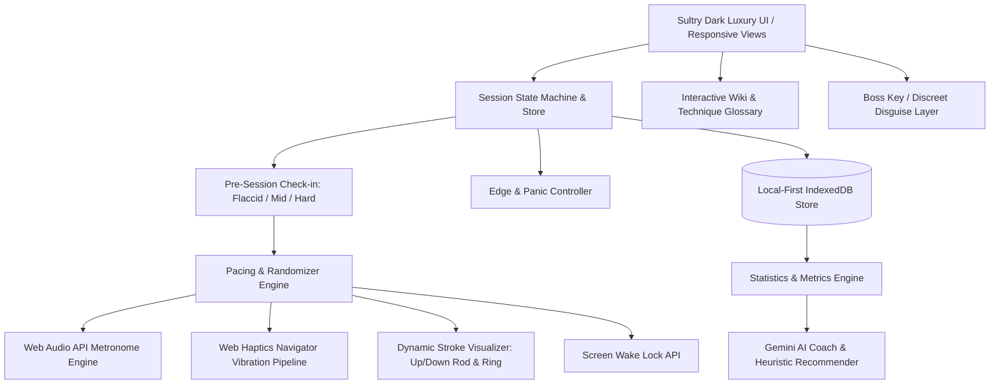

# Implementation Plan: InstructMe Pacing & Endurance WebApp

InstructMe is a premium, client-side Progressive Web Application (PWA) designed to guide male users through randomized, adaptive stroke pacing (Strokes Per Second - SPS), stroke depth modulation, pelvic floor (kegel) cues, edge control, and endurance training.

This document serves as the **Technical Specification and Execution Plan** following **Spec-Driven Development** principles.

---

## 1. System Architecture & Specification



### 1.1 Core Modules & Responsibilities

1. **Pre-Session Arousal Check-in (`src/features/session/PreSessionModal.tsx`)**:
   - Before starting any session, prompts the user:
     - **Flaccid / Soft**: Automatically schedules a gentle 3-5 minute Warmup phase (slower SPS: 0.5 - 1.0, gentle shallow/mid strokes, no high-intensity bursts) to comfortably bring user to arousal.
     - **Semi / Mid**: Starts with a balanced escalation phase (1.2 - 2.0 SPS, varied depths).
     - **Fully Erect / Ready**: Starts directly into active stamina training / plateau cycles.

2. **Pacing & Randomizer Engine (`src/core/engine/`)**:
   - Computes dynamic Strokes Per Second (SPS: `0.2` to `4.5`), stroke depth (`Tip`, `Shallow`, `Mid`, `Deep`, `Full`), and technique modifiers (`Continuous`, `Push & Stop`, `Pull & Stop`, `Hold / Freeze`, `Squeeze / Kegel`, `Breathe & Relax`).
   - Translates SPS to human-readable cadence (e.g. **2.5 SPS = 5 strokes in 2 seconds**, **1.0 SPS = 1 stroke per second**).
   - Generates unpredictable yet controlled phase transitions according to user-selected parameter boundaries.
   - Pacing clock with sub-millisecond precision scheduling using Web Audio AudioContext clock synchronization to avoid Javascript timer drift.

3. **Guided Visualized Strokes (`src/components/visualizer/`)**:
   - **Interactive Stroke Cylinder / Rod Visualizer**:
     - Visualizes the moving stroke up and down in real-time with smooth CSS/Canvas animation.
     - Highlights the exact target depth (markers for `Tip`, `Shallow`, `Mid`, `Deep`, `Full`).
     - Shows directional stroke arrows (`▲ Pull` / `▼ Push`) and stroke phase (downstroke vs upstroke).
   - **Cadence & Burst Indicator**:
     - Displays numerical SPS alongside a relatable cadence indicator (e.g., *"5 strokes in 2 seconds"*).
     - Circular progress ring pulsing with each stroke beat.

4. **Interactive Wiki & Knowledge Base (`src/features/wiki/WikiScreen.tsx`)**:
   - Accessible anytime via dedicated navigation tab or in-session `(?)` quick tooltips.
   - **Stroke Depth Glossary with Diagrams**:
     - **Tip**: Stimulation focused solely on the glans / coronal ridge.
     - **Shallow**: Top 1/3 of the shaft down from the head.
     - **Mid**: Central shaft strokes (middle 50%).
     - **Deep**: Base-focused strokes (bottom 2/3 of shaft).
     - **Full**: Complete length strokes from base to tip.
   - **Speed (SPS) Guide**: Explaining pacing rates from slow edging (0.5 SPS = 1 stroke every 2s) to rapid stimulation (2.5 SPS = 5 strokes in 2s, up to 4.0 SPS).
   - **Pelvic Floor (Kegel) Training**: How to identify the pubococcygeus (PC) muscle, when to squeeze, and the importance of reverse kegels (conscious relaxation) to halt premature climax.
   - **Edging & Breathwork**: The 4-7-8 breathing method for edge recovery, the "point of no return" awareness, and dopamine resetting.

5. **Sensory Feedback Pipeline (`src/core/sensory/`)**:
   - **Web Audio Synth**: Generates crisp, synthesized audio clicks, wooden block / metallic metronome beats, low sub-bass pulses on deep strokes, and soothing ambient chimes for pause/hold. Fully customizable tone frequencies and volume.
   - **Web Haptics API (`navigator.vibrate`)**: Distinct tactile patterns mapped to downstroke (heavy pulse), upstroke (light tap), depth intensity (multi-tap for deep/full), squeeze alert (prolonged buzz), and panic halt (rapid double vibration).
   - **Screen Wake Lock API**: Maintains screen active during sessions without dimming or locking.

6. **Session State Machine & Edge Controller (`src/core/session/`)**:
   - Finite state machine with states: `Idle` -> `ArousalCheck` -> `Warmup` -> `Escalation` -> `EdgeMaintenance` -> `PanicHold` -> `ClimaxRelease` -> `Summary`.
   - **Panic Button**: Instant recovery trigger. Drops SPS to 0, switches to a guided 4-7-8 deep breathing animation with soothing haptics to drop arousal back from the brink of premature ejaculation.
   - **"I'm Close / Edging" Button**: Real-time feedback trigger. Records an edge milestone, alters the randomizer intensity (either switches to edge-teasing intervals, or slows down/speeds up dynamically based on session settings).

7. **Data Layer & Privacy Guard (`src/core/db/`)**:
   - 100% Local-First IndexedDB schema storing Session Logs, Custom Routines, User Settings, and Progress Milestones.
   - **Discreet "Boss Key"**: Instant single-key shortcut (`Esc` or stealth tap) to disguise the entire application as a clean mock note-taking or code editor dashboard.
   - Optional PIN protection on app launch.
   - Full JSON Export & Import (zero cloud lock-in, zero unauthorized telemetry).

8. **Analytics & AI Stamina Coach (`src/core/ai/` & `src/features/analytics/`)**:
   - Interactive charts (Session duration over time, Average SPS distribution, Edge count per session, Time in edge state, Stamina retention index).
   - **Gemini API Integration**: Analyzes historical session logs and user notes to deliver personalized stamina advice, customized routine recommendations, and arousal-control feedback.
   - **Built-in Heuristic AI fallback**: Works 100% offline if no API key is provided.

9. **PWA & Mobile Optimization (`public/`, `vite.config.ts`)**:
   - Web App Manifest, Service Worker for offline execution, install prompt banner, touch-first ergonomic mobile layout (one-handed thumb zone for Panic and Edge buttons).

---

## 2. Design System Specification: "Sultry Dark Luxury"

InstructMe will adhere strictly to a single, unified design language:
- **Palette**:
  - Background: Velvet Obsidian (`#0A0A0E`), Dark Charcoal Surface (`#14141B`), Glass Border (`rgba(255, 255, 255, 0.08)`).
  - Primary Accent: Warm Rose Gold (`#E0A899`) and Radiant Amber (`#E5A95D`).
  - Secondary Accent / Passion: Velvet Violet (`#8B5CF6`) and Neon Coral (`#F43F5E`).
  - Calming / Panic Accent: Ethereal Mint / Cyan (`#2DD4BF`) for recovery and breathing states.
  - Text: Frost White (`#F8FAFC`) primary, Champagne Muted (`#94A3B8`) secondary.
- **Glassmorphism**: Soft background blur (`backdrop-blur-md`), subtle radial glow effects on active stroke rhythms.
- **Typography**: Modern geometric sans-serif (`Outfit` or `Plus Jakarta Sans` with `JetBrains Mono` for real-time numerical SPS and timers).
- **Haptic UI**: Micro-haptics triggered on every button press, slider drag, and toggle on mobile.

---

## 3. Proposed Project Structure

```
d:/Codes/InstructMe/
├── index.html
├── package.json
├── tsconfig.json
├── vite.config.ts
├── public/
│   ├── favicon.svg
│   ├── manifest.json
│   ├── icons/
│   │   ├── icon-192.png
│   │   └── icon-512.png
│   └── sw.js
└── src/
    ├── main.tsx
    ├── App.tsx
    ├── index.css
    ├── types/
    │   ├── session.ts
    │   ├── routine.ts
    │   └── settings.ts
    ├── core/
    │   ├── audio/
    │   │   └── audioEngine.ts          # Web Audio synth metronome
    │   ├── haptics/
    │   │   └── hapticsEngine.ts        # Vibration patterns & fallback
    │   ├── wakelock/
    │   │   └── wakeLock.ts             # Screen Wake Lock manager
    │   ├── engine/
    │   │   ├── randomizer.ts           # Dynamic SPS, depth & technique randomizer
    │   │   └── scheduler.ts            # High-precision beat scheduler
    │   ├── session/
    │   │   └── sessionStore.ts         # Session state machine (Zustand/Context)
    │   ├── db/
    │   │   └── storage.ts              # IndexedDB local storage engine
    │   └── ai/
    │       ├── geminiCoach.ts          # Gemini API analysis client
    │       └── heuristicCoach.ts       # Offline rule-based analytics
    ├── components/
    │   ├── common/
    │   │   ├── Button.tsx
    │   │   ├── Card.tsx
    │   │   ├── Modal.tsx
    │   │   └── Slider.tsx
    │   ├── layout/
    │   │   ├── Header.tsx
    │   │   ├── Navigation.tsx
    │   │   └── DiscreetOverlay.tsx     # Boss key disguise screen
    │   ├── visualizer/
    │   │   ├── StrokeGauge.tsx         # Circular & linear rhythmic visualizer
    │   │   ├── StrokeRodVisualizer.tsx # Guided Up/Down stroke bar with depth levels
    │   │   ├── DepthIndicator.tsx      # Tip/Shallow/Mid/Deep/Full visual depth gauge
    │   │   ├── MusclePrompt.tsx        # Squeeze/Relax pelvic cue overlay
    │   │   └── BreathingRing.tsx       # 4-7-8 breathing circle for Panic Hold
    │   └── session/
    │       ├── ControlsBar.tsx         # Panic & Edge thumb-zone triggers
    │       ├── PreSessionModal.tsx     # Starting state check-in (Flaccid/Mid/Hard)
    │       ├── SessionConfigModal.tsx  # Parameters inclusion selector
    │       └── SessionSummaryModal.tsx # Post-session rating & review
    ├── features/
    │   ├── session/
    │   │   └── SessionScreen.tsx       # Live session active screen
    │   ├── wiki/
    │   │   ├── WikiScreen.tsx          # Terminology glossary & technique guides
    │   │   └── DepthDiagram.tsx        # Interactive visual breakdown of Tip to Full
    │   ├── routines/
    │   │   ├── RoutineListScreen.tsx   # Pre-made & custom routines
    │   │   └── RoutineEditorScreen.tsx # Custom pattern builder
    │   ├── stats/
    │   │   ├── StatsScreen.tsx         # Charts, trends, endurance analysis
    │   │   └── AiAdviceCard.tsx        # Gemini AI feedback & tips
    │   └── settings/
    │       └── SettingsScreen.tsx      # Audio, haptic, privacy PIN, API key settings
    └── utils/
        └── formatters.ts               # SPS to intuitive cadence conversion (e.g. 5 in 2s)
```

---

## 4. Phased Implementation Plan

### Phase 1: Foundation & Project Bootstrapping
- Initialize Vite React TypeScript project in the workspace with proper `npx` tooling.
- Install production dependencies: `lucide-react`, `canvas-confetti` (for climax release celebrations).
- Set up CSS design system with complete "Sultry Dark Luxury" token configuration, typography, and responsive frame.

### Phase 2: Sensory & Precision Timing Engine
- Build `audioEngine.ts`: Web Audio API oscillator with synthesized wood block, click, and sub-pulse tones.
- Build `hapticsEngine.ts`: Vibration pattern generator supporting downstroke, upstroke, depth multi-taps, squeeze pulses, and panic buzz.
- Build `wakeLock.ts`: Automatic screen wake lock manager.
- Build `scheduler.ts` and `randomizer.ts`: Clock synchronization running on `requestAnimationFrame` and Web Audio timeline, calculating SPS, stroke depth, technique cues, and smooth transitions.
- Build cadence helper `formatCadence(sps)` (e.g. `2.5 SPS` -> `"5 strokes in 2s"`).

### Phase 3: Visualized Stroke Guides & Ergonomic Session Interface
- Design `StrokeRodVisualizer.tsx`: Visual guided cylinder showing real-time physical stroke movement up/down, hitting exact depth markers (`Tip`, `Shallow`, `Mid`, `Deep`, `Full`) in lockstep with the audio beat and vibration.
- Design `StrokeGauge.tsx`: Circular halo gauge with live SPS and relatable cadence readout.
- Build `PreSessionModal.tsx`: Starting state check-in (`Flaccid` -> warmup phase, `Mid` -> moderate escalation, `Hard` -> immediate stamina wave).
- Build `MusclePrompt.tsx`: Clear, non-distracting pelvic floor contraction ("Squeeze") and relaxation ("Release") cues.
- Build `ControlsBar.tsx`:
  - **Prominent Panic Button**: Always reachable with single thumb tap. Halts pacing, opens `BreathingRing.tsx` with 4-7-8 calm breath pacing.
  - **"I'm Close / Edge" Button**: Logs edge count, increases unpredictability or drops pacing smoothly.
  - **Release / Climax Button**: Transitions to final sprint and confetti climax celebration.

### Phase 4: Wiki & Knowledge Base Feature
- Build `WikiScreen.tsx` & `DepthDiagram.tsx`:
  - Visual interactive anatomical/shaft depth diagram (`Tip`, `Shallow`, `Mid`, `Deep`, `Full`).
  - Speed & Cadence guide with interactive sample metronome (e.g., test 5 strokes in 2 seconds).
  - Kegel & Pelvic floor contractions guide.
  - Edge control & the 4-7-8 breathing method.
- Add quick tooltip triggers `(?)` from the session view so users can inspect terms without stopping their flow.

### Phase 5: Session Configurations & Routine Builder
- Parameter configuration modal: Select allowable SPS range (e.g. 0.5 - 3.0), toggle Depth randomization, toggle Squeeze/Kegel prompts, toggle Pause/Hold intervals.
- Routine Creator: Allow users to build custom phased sequences.
- Preset routines: "Endurance Builder", "Edge Mastery", "Quick Randomizer", "Surprise Chaos".

### Phase 6: Local Database, Statistics & AI Coach
- IndexedDB storage for session history (date, duration, starting state, edges logged, average SPS, climax reached, pleasure rating 1-5, reflection notes).
- Interactive SVG/Canvas charts for session endurance trends and SPS distributions.
- Gemini API integration + heuristic fallback engine for personalized stamina tips.
- Discreet Mode ("Boss Key"): Instant keyboard shortcut (`Esc`) or quick tap icon that swaps the screen to a discreet notes page.

### Phase 7: PWA, Verification & Polishing
- Service worker registration and `manifest.json` with sleek app icons.
- Mobile testing for haptic responsiveness, touch ergonomics, and sound synthesizer latency.
- Comprehensive end-to-end verification.

---

## 5. Verification Plan

### Automated Tests & Quality Checks
- Run TypeScript type checks (`tsc --noEmit`).
- Verify production build bundle (`npm run build`).

### Manual & Sensory Verification
1. **Pre-Session State Check-in**: Select "Flaccid", verify session initiates with gentle Warmup cadence; select "Hard", verify immediate stamina pacing.
2. **Stroke Visualizer & Cadence**: Start session at 2.5 SPS; verify visual stroke moves up/down smoothly showing "5 strokes in 2 seconds", synchronized with audio click and haptic vibration.
3. **Interactive Wiki**: Open Wiki page; verify interactive diagrams for Tip, Shallow, Mid, Deep, Full, and test sound/pacing samples.
4. **Panic Button Recovery**: Tap Panic Button mid-session; verify instant halt, switch to 4-7-8 breathing ring, calming haptics, and smooth resume.
5. **Edge Trigger**: Tap "I'm Close"; verify edge count increment, visual indicator, and session summary log.
6. **Boss Key**: Press `Esc` or tap disguise button; verify instant display of discreet screen.
7. **Data Persistence**: Complete a session, view Stats screen; verify graphs and logs display accurate historical metrics.
8. **PWA & Offline**: Verify offline access via Service Worker.
